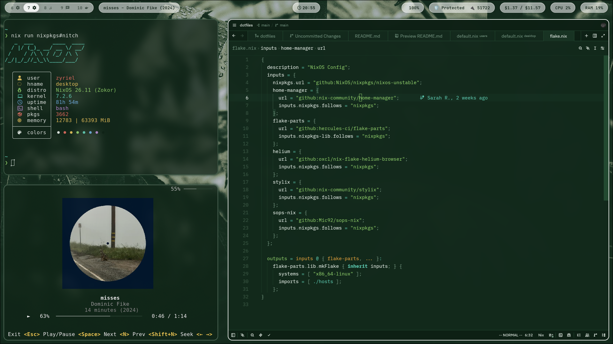

# dotfiles

Only managing my desktop at the moment, will add a laptop and WSL config at some point :p



## Layout
```
hosts/      per-machine config (composition, hardware, host-specific bits)
features/   host-agnostic modules with enable options
modules/    shared system plumbing (boot, audio, locale, secrets, ...)
home/       home-manager config (user, dotfiles, scripts)
themes/     stylix base16 schemes
```
